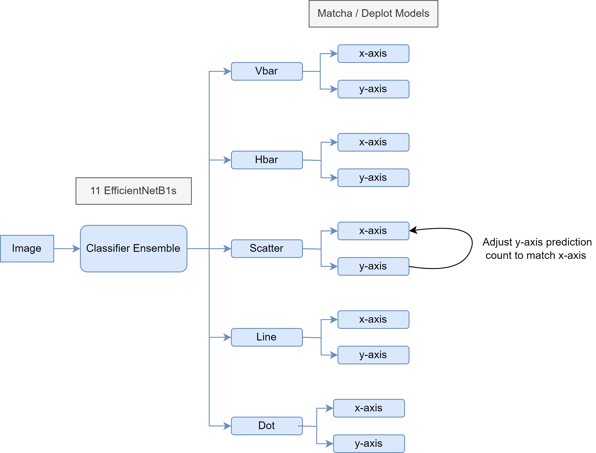

# Benetech - Making Graphs Accessible Competiton

This repository contains code for the 38th place solution in the [Benetech - Making Graphs Accessible competition](https://www.kaggle.com/competitions/benetech-making-graphs-accessible) on Kaggle.

<h1 align="center">

</h1>

## Improvements

Use SOTA models (effnet -> effnetv2)
- V2s are faster to train and more accurate
- See [Thanh's 1st Place Solution](https://www.kaggle.com/competitions/benetech-making-graphs-accessible/discussion/418510)

Do not overfit the training data and public LB.
- I used too many synthetically generated plots, and overfit the extracted data

Should have used more "real" plots
- Needed to use more diverse extracted datasets for training (ICDAR, ChartQA, PlotQA, etc.)

Could have used a more creative synthetic data generation process
- Extract X-Y data from Wikipedia data + glossary
- See [Raja Biswas's 2nd Place Solution](https://www.kaggle.com/competitions/benetech-making-graphs-accessible/discussion/418430)

Needed a better CV setup
- Use smaller models to test ideas and scale up in the end
- Set up a way to validate single models and ensembles early on (ie. add a valdiate.py file)

Classifier and Counting performance was not strong
- For a chart to be scored it had to be classified correctly, and have the right number of points
- Classification CV was ~95%, but other solutions were ~99.5% (they used more "real" plots)

Need to focus more on the ensemble
- Work on ensembles in local CV to find good combinations
- Look at the correlation between different high-performing models (and pick ones that are quite different)
- See [1st Place Solution of the Mechanisms of Action Competition](https://www.kaggle.com/competitions/lish-moa/discussion/201510)

## Positives

Best place in a Kaggle competition this far!
- Reduced precision of the data 
- Trained a separate pix2struct model for each chart type and axis (10 models)
- Setup Torch-Lightning code to quickly test ideas
- Put together a plot generator

